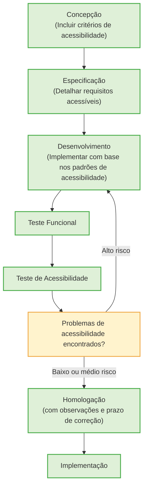

# Definition Of Ready (DOR) para Acessiblidade

Para garantir que uma funcionalidade esteja efetivamente pronta para ser submetida aos testes finais de acessibilidade e, eventualmente, para ser disponibilizada ao público, é essencial que ela atenda a critérios técnicos mínimos que assegurem sua qualidade e inclusão desde as etapas iniciais de desenvolvimento. Nesse sentido, a definição de critérios claros na chamada Definition of Ready (DoR) se torna uma prática recomendada em ambientes ágeis, permitindo que o desenvolvimento avance com responsabilidade e foco na experiência do usuário.

De acordo com a W3C‑WAI (2025), a acessiblidade deve ser considerada desde o início do ciclo de desenvolvimento do projeto, incluindo a acessibilidade na programação e utilizando checklists já na fase de planejamento para evitar retrabalho e internalizar práticas acessíveis. A adoção de critérios de acessibilidade como parte da DoR contribui para que a acessibilidade deixe de ser vista como um “ajuste posterior” e passe a ser considerada um elemento estrutural do produto.

Dentre os critérios que devem compor essa preparação mínima, destacam-se:

•	**Testes funcionais aprovados**: Garantem que o comportamento esperado da funcionalidade esteja intacto antes de iniciar testes específicos de acessibilidade, assegurando que falhas não relacionadas à acessibilidade não interfiram na avaliação.

•	**Verificação com ferramentas automáticas de acessibilidade, como o Axe DevTools e o Colour Contrast Analyser**: Essas ferramentas ajudam a identificar falhas rápidas, como ausência de atributos ARIA, textos alternativos, estrutura de cabeçalhos e problemas de contraste, servindo como um primeiro filtro técnico.

•	**Navegação via teclado sem erros críticos**: A acessibilidade para usuários com deficiência motora depende da capacidade de interagir com todos os elementos da interface sem depender do mouse. Conforme defendem Harper e Yesilada (2008), a ausência de suporte ao teclado configura uma das barreiras mais frequentes e prejudiciais na web.

•	**Código compatível com tecnologias assistivas, como leitores de tela**: Elementos HTML devem estar semanticamente corretos e devidamente rotulados para que softwares como NVDA, VoiceOver e TalkBack interpretem e leiam corretamente o conteúdo.

Após a validação desses critérios, a dupla colaborativa realizará os testes de acessibilidade, seguindo o [roteiro de testes](roteiros.md#roteiros).

Fluxograma das Etapas:

**Descrição textual do fluxograma:**
O processo inicia na etapa **Concepção**, onde são considerados os critérios de acessibilidade.  
Em seguida, avança para a fase de **Especificação**, na qual os requisitos acessíveis são detalhados.  
Depois, segue para o **Desenvolvimento**, onde as funcionalidades são implementadas com base nos padrões de acessibilidade.  
O produto passa então pelo **Teste Funcional**, e em seguida pelo **Teste de Acessibilidade**.

Se não forem encontrados problemas de acessibilidade, ou se forem identificados problemas de **[baixo](classificacao_defeitos.md#baixo)** ou **[medio](classificacao_defeitos.md#medio)** risco, o processo segue para a etapa de **Homologação**, com observações registradas e um prazo definido para correção desses pontos.  
Após a homologação, ocorre a **Implementação**.

Por outro lado, se forem identificados problemas de acessibilidade considerados de **[alto](classificacao_defeitos.md#alto)** risco, o fluxo retorna à etapa de **Desenvolvimento** para que os erros sejam corrigidos.  
Em seguida, o produto é novamente submetido ao **Teste de Acessibilidade**, reiniciando o ciclo até que os problemas sejam resolvidos e o produto possa seguir para a homologação.
